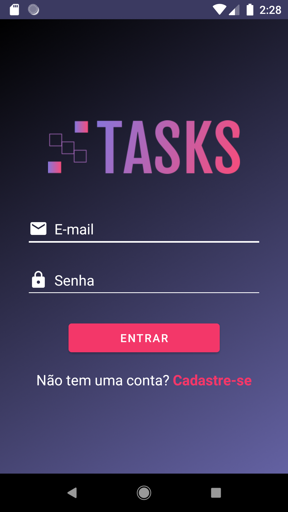
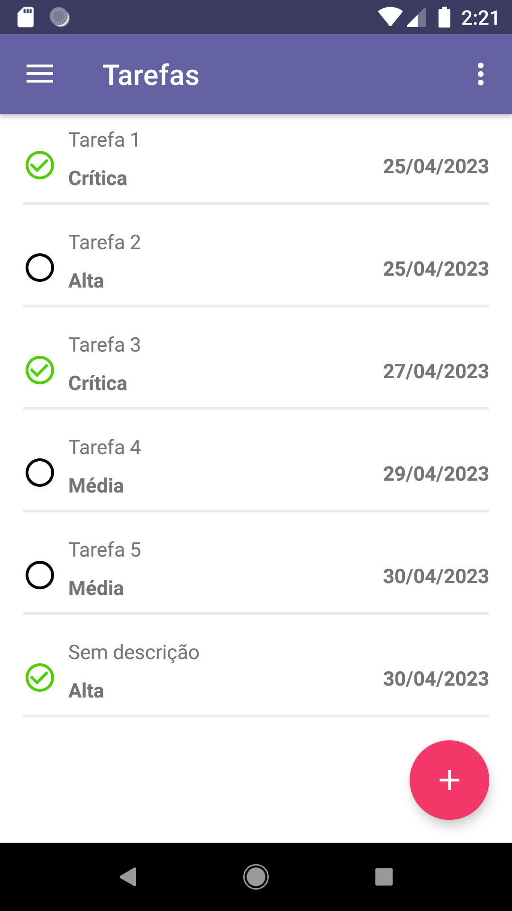
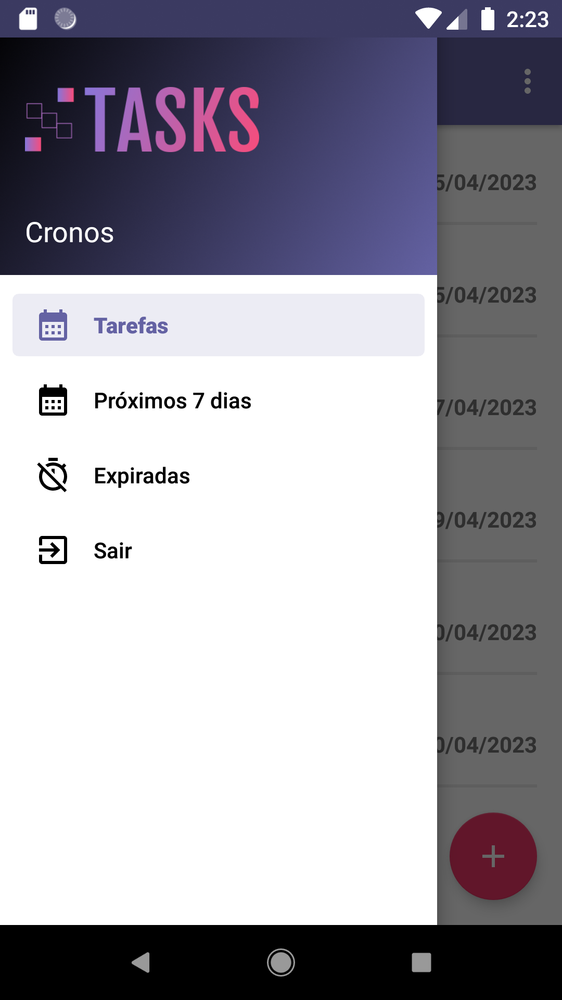
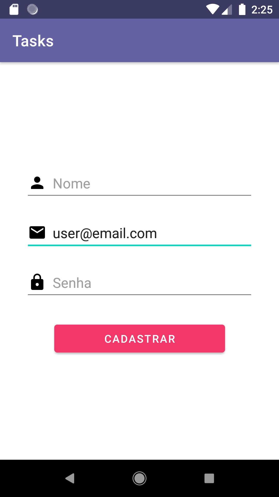
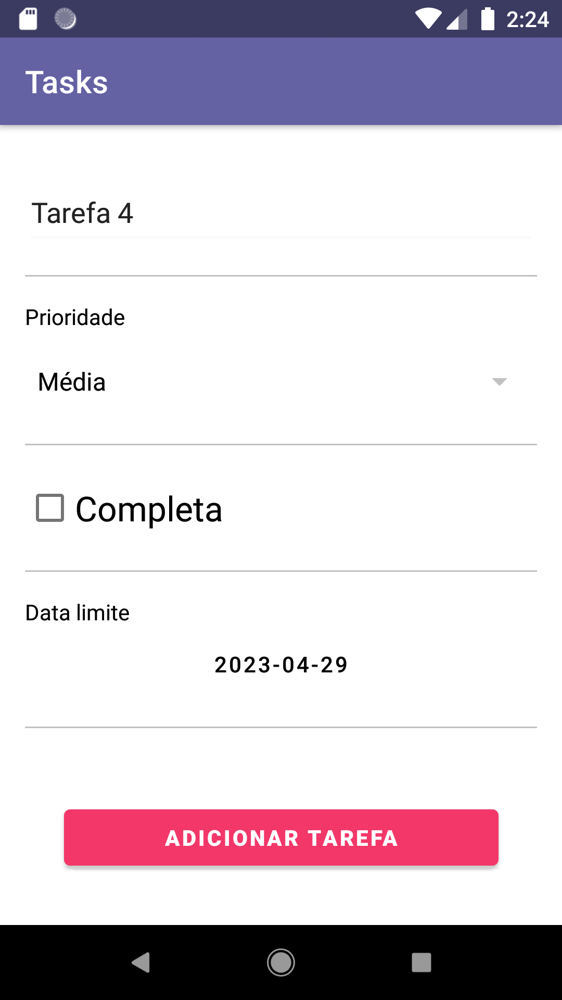

# Tasks
 O Tasks é um aplicativo para dispositivos Android para gerenciamento de tarefas. Este projeto foi desenvolvido em Kotlin e segue uma arquitetura MVVM.
 
 ## Tecnologias utilizadas
 - Kotlin
 - Android Jetpack (ViewModel, LiveData, Navigation, etc.)
 - Retrofit
 - Gson
 
 ## Funcionalidades

- Login e Cadastro de usuario
- Listagem de tarefas.
- Remoção de tarefas.
- Adição e remoção de tarefas.

## Capturas de Tela

    

## Arquitetura
O projeto segue a arquitetura MVVM (Model-View-ViewModel), que separa a lógica de negócio da interface do usuário. Ele é dividido em três camadas:

 - Model: responsável por acessar os dados do aplicativo (API externa neste caso) e fornecer os dados para a camada ViewModel.
 - View: responsável por exibir a interface do usuário e lidar com as interações do usuário. Ele se comunica com a camada ViewModel para atualizar a interface do usuário com os dados recebidos do Model.
 - ViewModel: responsável por gerenciar o estado da interface do usuário e processar as ações do usuário. Ele se comunica com a camada Model para buscar e atualizar os dados e se comunica com a camada View para atualizar a interface do usuário.

## API externa
Essa aplicação utiliza uma API externa para realizar o login de usuario e o gerenciamento das tarefas. A API usada neste projeto é a oferecida pela [DevMasterTeam](http://devmasterteam.com/CursoAndroid/API).

## Pré-requisitos

- Android Studio 4.0 ou superior.
- Android SDK 23 ou superior.
- Kotlin 1.4.21 ou superior.

